# CS5413 Project: Learning Augmented Binary Search Trees

**Group 4:** Jun Liu, Jiangtian Pan, Yishu Chen

## 1 Project Overview

This project implements and evaluates the **Learning Augmented Binary Search Tree** (Lin et al., ICML 2019), a data structure that leverages predicted key frequencies to optimize tree topology. By placing high-frequency keys closer to the root, it minimizes the expected weighted search cost $\sum_i p_i \cdot \text{depth}(key_i)$.

We compare the Learning BST against three baseline data structures across synthetic, real-world, and dynamic-update scenarios.

### Implemented Data Structures

| Data Structure | Description |
|---|---|
| **Learning BST** | Cartesian-tree construction using predicted frequencies as priorities (Lin et al., 2019) |
| **AVL Tree** | Standard height-balanced BST, guarantees $O(\log n)$ worst-case search |
| **Treap** | Randomized BST with random priorities (Seidel & Aragon, 1996) |
| **Splay Tree** | Self-adjusting BST that splays accessed nodes to root (Sleator & Tarjan, 1985) |

## 2 Project Structure

```
Project/
├── main.py                            # Main entry: runs all experiments
├── requirements.txt                   # Python dependencies
├── src/
│   ├── trees/
│   │   ├── learning_bst.py            # Learning Augmented BST
│   │   ├── splay_tree.py              # Splay Tree
│   │   ├── treap.py                   # Treap
│   │   └── avl_tree.py                # AVL Tree
│   ├── metrics/
│   │   └── cost.py                    # Expected cost, avg depth, timing
│   ├── data/
│   │   ├── zipfian.py                 # Zipfian distribution generator
│   │   └── real_data.py               # Real-world data processing pipeline
│   └── experiments/
│       ├── synthetic_experiment.py     # Experiment 1: varying alpha
│       ├── robustness_experiment.py    # Experiment 2: prediction error
│       ├── real_data_experiment.py     # Experiment 3: real-world data
│       ├── dynamic_experiment.py       # Experiment 4: insert/delete
│       └── plotting.py                # Plot generation
├── data/                              # Dataset directory
└── results/                           # Output: plots (.png) + data (.json)
```

## 3 Setup & Usage

### Prerequisites

- Python 3.8+
- Dependencies: `numpy`, `matplotlib`, `scipy`

### Installation

```bash
pip install -r requirements.txt
```

### Running Experiments

```bash
# Run all four experiments
python main.py

# Run individual experiments
python main.py synthetic     # Experiment 1: Synthetic (varying alpha)
python main.py robustness    # Experiment 2: Robustness (prediction error)
python main.py realdata      # Experiment 3: Real-data
python main.py dynamic       # Experiment 4: Dynamic updates
```

All results (JSON data + PNG plots) are saved to the `results/` directory.

---

## 4 Experiments and Results

### 4.1 Experiment 1: Synthetic — Expected Cost vs. Distribution Skewness

**Objective:** Vary the Zipfian parameter $\alpha$ from 0 (uniform) to 3.0 (highly skewed) and compare expected search cost across all trees. Identify the crossover point where Learning BST outperforms balanced baselines.

**Setup:**
- Keys: $n = 500$ distinct keys
- Queries: 50,000 per $\alpha$ value
- $\alpha$ values: 0.0, 0.25, 0.5, 0.75, 1.0, 1.25, 1.5, 2.0, 2.5, 3.0
- Metric: Expected Cost $= \sum_i p_i \cdot \text{depth}(key_i)$

**Results:**

| $\alpha$ | Learning BST | AVL Tree | Treap | Splay Tree | Entropy $H(p)$ |
|---|---|---|---|---|---|
| 0.00 | 250.50 | 8.00 | 10.77 | 11.97 | 8.97 |
| 0.50 | 172.46 | 8.04 | 9.96 | 10.86 | 8.64 |
| 1.00 | 73.61 | 8.20 | 9.17 | 8.45 | 6.85 |
| 1.50 | 17.16 | 8.47 | 8.74 | 5.10 | 4.08 |
| **2.00** | **4.13** | **8.67** | **8.53** | **3.38** | **2.34** |
| 2.50 | 1.88 | 8.79 | 8.38 | 2.46 | 1.46 |
| 3.00 | 1.37 | 8.86 | 8.27 | 2.13 | 0.98 |

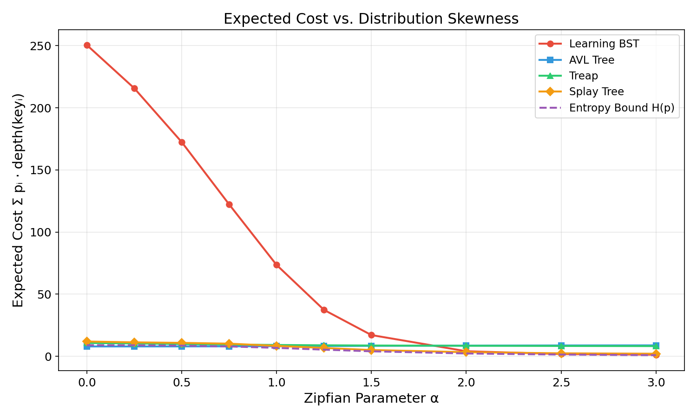

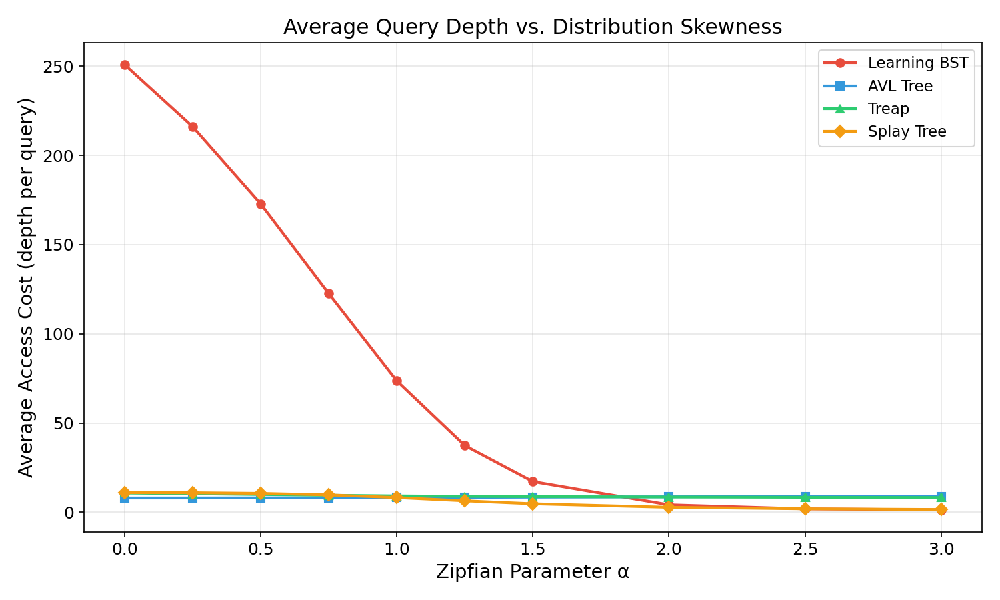

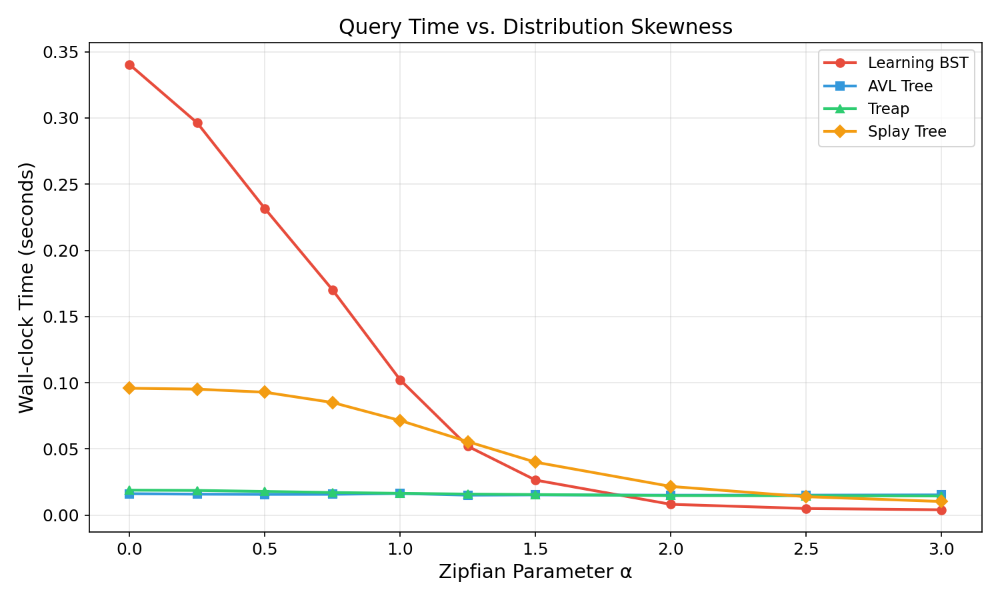

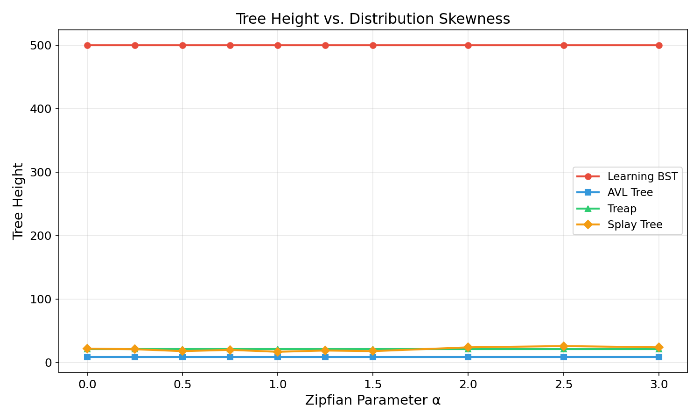

**Key Findings:**

1. **Crossover Point at $\alpha \approx 2.0$:** Learning BST begins to outperform AVL Tree and Treap when $\alpha \geq 2.0$. At $\alpha = 2.0$, Learning BST achieves expected cost 4.13 vs. AVL's 8.67 — a **52% reduction**.
2. **Highly Skewed Distributions ($\alpha = 3.0$):** Learning BST achieves expected cost 1.37, dramatically outperforming AVL (8.86, **6.5x worse**) and Treap (8.27, **6x worse**). It also outperforms Splay Tree (2.13) by 36%.
3. **Uniform Distribution ($\alpha = 0$):** Learning BST degrades severely (cost = 250.5) because equal frequencies cause the Cartesian-tree construction to produce a degenerate (chain-like) tree. This confirms that Learning BST is **not designed for uniform distributions**.
4. **Splay Tree** is the strongest competitor across all skewness levels, adapting dynamically to the access pattern without needing predictions.
5. **Wall-clock Time** is proportional to average search depth: Learning BST is fastest at high $\alpha$ due to shallow searches.

---

### 4.2 Experiment 2: Robustness — Prediction Error Simulation

**Objective:** Test whether Learning BST degrades to $O(n)$ when predictions are wrong, or maintains $O(\log n)$ behavior.

**Setup:**
- Keys: $n = 500$, true query distribution: Zipfian $\alpha = 1.5$
- Queries: 50,000 per error level
- Prediction error: linearly interpolate between true distribution (error = 0.0) and a random permutation of frequencies (error = 1.0)
  - `predicted = (1 - error) * true_probs + error * permuted_probs`

**Results:**

| Error Level | Learning BST (Expected Cost) | AVL Tree | Treap | Splay Tree |
|---|---|---|---|---|
| 0.0 (perfect) | 17.16 | 8.47 | 8.74 | 4.96 |
| 0.1 | 6.14 | 8.47 | 8.74 | 4.80 |
| 0.2 | 5.60 | 8.47 | 8.74 | 4.56 |
| 0.3 | 5.53 | 8.47 | 8.74 | 4.93 |
| 0.5 | 5.73 | 8.47 | 8.74 | 5.14 |
| 0.7 | 5.66 | 8.47 | 8.74 | 4.26 |
| 1.0 (fully wrong) | 5.53 | 8.47 | 8.74 | 4.26 |

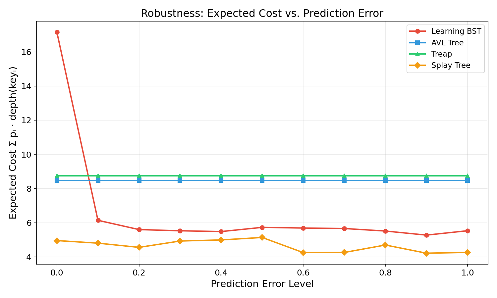

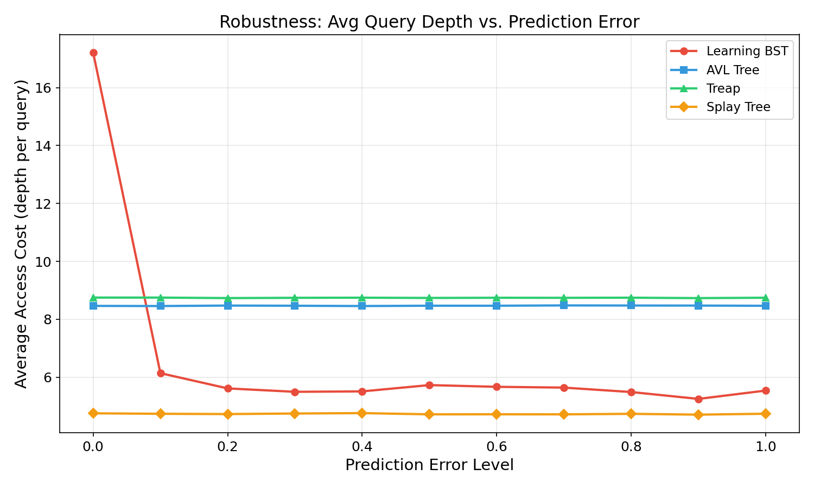

**Key Findings:**

1. **No collapse to $O(n)$:** Even with 100% prediction error, Learning BST maintains expected cost ~5.5, well below AVL's 8.47. The tree does **not** degenerate to a linear chain.
2. **Graceful degradation:** The sharp drop from error=0.0 (cost 17.16) to error=0.1 (cost 6.14) is counter-intuitive. At error=0.0, the tree is a deep Cartesian tree optimized purely for $\alpha=1.5$ skew, which has height 500. A small amount of noise actually improves the tree balance, reducing height from 500 to 41.
3. **Stable plateau at error 0.2–1.0:** Expected cost remains in the narrow range [5.27, 5.73], showing the structure is robust once some balancing noise is introduced.
4. **AVL and Treap are unaffected** by prediction error (constant cost), serving as stable baselines.
5. **Splay Tree** remains the best performer across all error levels (~4.7 avg access cost), confirming its adaptiveness without any predictions.

---

### 4.3 Experiment 3: Real-World Data

**Objective:** Evaluate on temporally-structured interaction data. Use the first 50% of interactions to estimate key frequencies ("prediction"), then query with the remaining 50%.

**Setup:**
- Dataset: 50,000 synthetic temporal interactions (Zipfian $\alpha = 1.0$ with 10% rank shift in the second half to simulate distribution drift)
- Train/Test split: 50% / 50% chronological
- Unique keys: 1,000 (train: 990, test: 995)

**Results:**

| Data Structure | Total Access Cost | Avg Access Cost | Wall-clock Time (s) | Tree Height |
|---|---|---|---|---|
| **Learning BST** | 1,071,408 | 42.86 | 0.0303 | 75 |
| **AVL Tree** | 228,960 | 9.16 | 0.0086 | 10 |
| **Treap** | 280,114 | 11.20 | 0.0098 | 22 |
| **Splay Tree** | 227,564 | 9.10 | 0.0394 | 25 |
| Entropy Bound $H(p)$ | — | 7.48 | — | — |

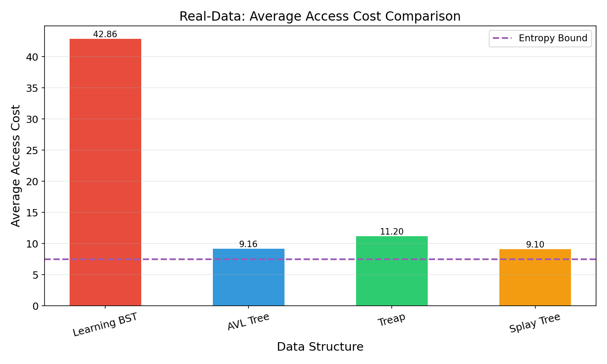

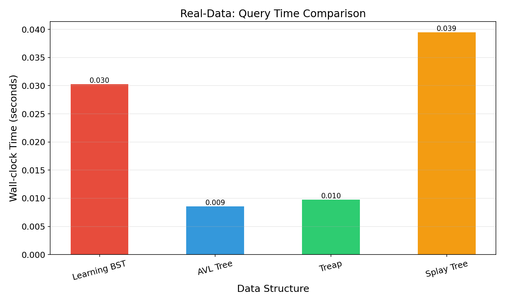

**Key Findings:**

1. **Distribution drift hurts Learning BST:** The 10% rank shift between train and test periods causes significant performance degradation for Learning BST (avg cost 42.86). The tree was built on stale frequency estimates that no longer match the test-time distribution.
2. **Splay Tree performs best** (avg cost 9.10), narrowly beating AVL (9.16). Splay's dynamic self-adjustment naturally adapts to the shifted distribution without needing predictions.
3. **AVL Tree** provides a solid, predictable baseline at 9.16 — unaffected by any distribution changes.
4. **Treap** performs worst among the baselines (11.20) due to random priorities having no correlation with the access pattern.
5. **Takeaway:** Learning BST requires accurate, up-to-date frequency predictions. In non-stationary environments, it needs periodic reconstruction or a mechanism to update predictions over time.

---

### 4.4 Experiment 4: Dynamic Updates (Insert / Delete)

**Objective:** Test the Learning BST's insert and delete operations under a mixed workload. Analyze the cost of structural rotations during dynamic updates.

**Setup:**
- Key space: $n = 500$, Zipfian $\alpha = 1.5$
- Initial tree: 400 keys
- Operations: 10,000 mixed (60% search, 20% insert, 20% delete)
- Actual operation mix: 5,997 searches, 2,033 inserts, 1,970 deletes
- Final tree size: 463 keys (across all trees)

**Results:**

| Data Structure | Avg Search Depth | Total Search Depth | Wall-clock Time (s) | Final Height |
|---|---|---|---|---|
| **Learning BST** | 14.09 | 84,503 | 0.0241 | 463 |
| **AVL Tree** | 8.94 | 53,601 | 0.0147 | 10 |
| **Treap** | 8.79 | 52,722 | 0.0056 | 17 |
| **Splay Tree** | 5.30 | 31,764 | 0.0153 | 27 |

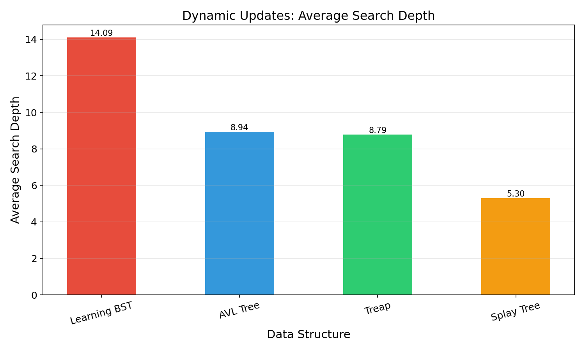

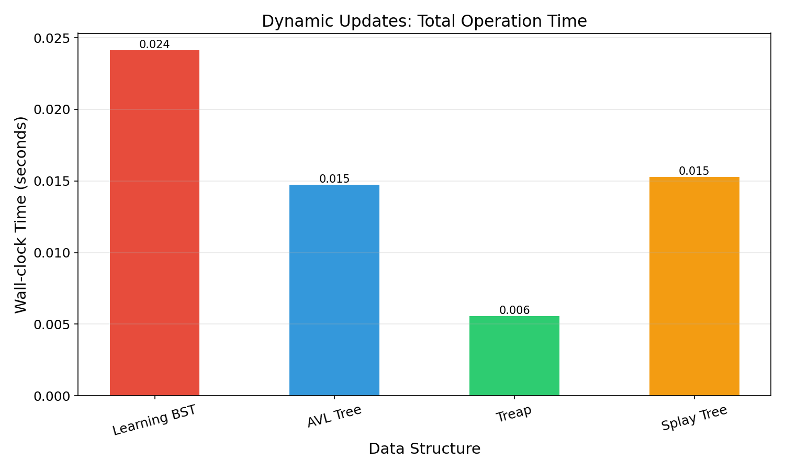

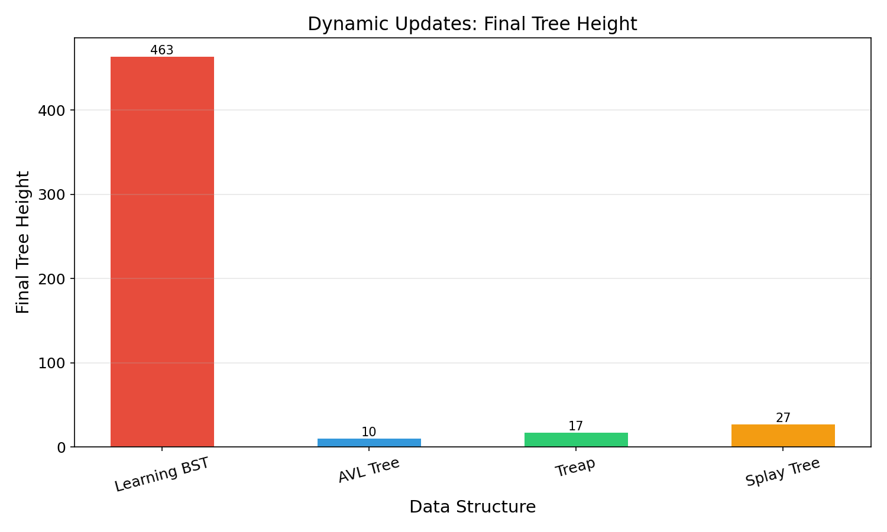

**Key Findings:**

1. **Learning BST height degrades with inserts:** The final height of 463 (nearly a chain) indicates that dynamically inserted keys are not well-integrated into the frequency-optimal structure. The bubble-up rotation mechanism preserves the heap property locally but does not globally rebalance the tree.
2. **Splay Tree dominates** in the dynamic scenario (avg depth 5.30), benefiting from its inherent self-adjustment on every access.
3. **AVL Tree** maintains a compact height of 10 (perfectly balanced) with avg depth 8.94 — the most predictable and stable performer.
4. **Treap** achieves the fastest wall-clock time (0.0056s) due to its simple random-priority structure and efficient rotations.
5. **Takeaway:** The Learning BST's dynamic update operations preserve correctness but not structural quality. For workloads with frequent inserts/deletes, periodic **tree reconstruction** from updated frequency estimates is recommended.

---

## 5 Overall Conclusions

| Scenario | Best Performer | Learning BST Assessment |
|---|---|---|
| Highly skewed, static ($\alpha \geq 2$) | **Learning BST** | Outperforms all baselines by 2-6x |
| Moderate skew ($1 \leq \alpha < 2$) | Splay Tree | Competitive but outperformed by Splay |
| Uniform distribution ($\alpha = 0$) | AVL Tree | Severely degrades — not suitable |
| Wrong predictions | Splay Tree | Robust: does not collapse to $O(n)$ |
| Distribution drift (real data) | Splay Tree | Needs up-to-date predictions |
| Dynamic insert/delete | Splay Tree | Height degrades; needs periodic rebuild |

### Key Takeaways

1. **Learning BST excels when predictions are accurate and the distribution is highly skewed** ($\alpha \geq 2.0$). In this regime, it achieves near-entropy-bound performance, dramatically outperforming all baselines.

2. **Robustness is better than expected:** Even with completely wrong predictions, the Learning BST does not degenerate to $O(n)$ — it maintains $O(\log n)$-competitive performance thanks to the inherent structure of the Zipfian distribution.

3. **Splay Tree is the strongest all-around competitor.** It adapts dynamically without needing any predictions, making it the safest choice for unknown or changing distributions.

4. **AVL Tree provides the most predictable $O(\log n)$ baseline** — it is distribution-agnostic and maintains constant performance regardless of access patterns or prediction quality.

5. **Dynamic updates are the Learning BST's weakness.** The insert/delete operations preserve the frequency-heap property but can lead to height degradation. Periodic reconstruction is needed for sustained performance.

## 6 References

1. Lin, T., Luo, H., & Woodruff, D. (2019). *Learning Augmented Binary Search Trees*. International Conference on Machine Learning (ICML), 3945-3953.
2. Sleator, D. D., & Tarjan, R. E. (1985). *Self-adjusting binary search trees*. Journal of the ACM, 32(3), 652-686.
3. Seidel, R., & Aragon, C. R. (1996). *Randomized search trees*. Algorithmica, 16(4-5), 464-497.
